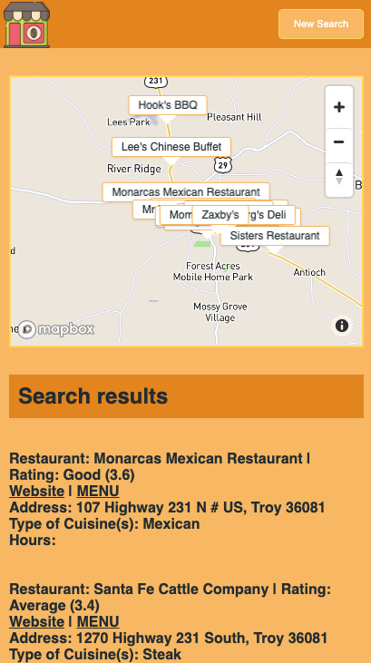
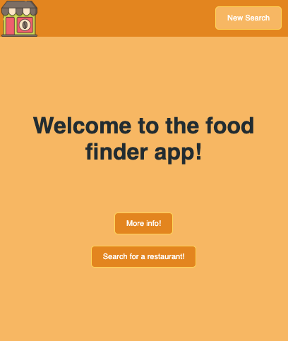
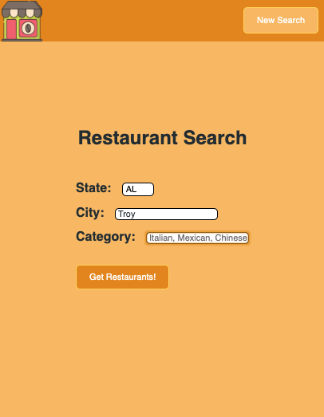

Name: MunchMap
Live App: https://holly257.github.io/APIhack-restaurantMap/
Screenshots:

 

 

Summary: Munch Map takes a users input and returns options for resturants in the designated location. A user can refine their search results by city and cuisine type, or search for all the resturants near the entered city. 
Technology Used: HTML, CSS, JavaScript, jQuery
