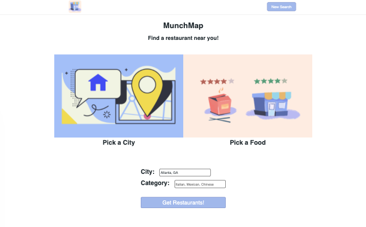
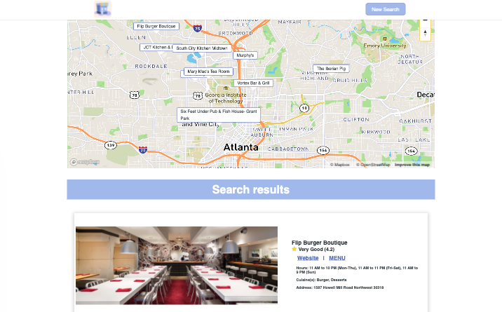

Name: MunchMap  
Live App: https://holly257.github.io/APIhack-restaurantMap/  
Screenshots: 
 

 

Summary: Munch Map takes a user's input and returns options for restaurants in the designated location. A user can refine their search results by city and cuisine type, or search for all the restaurants near the entered city 
Technology Used: HTML, CSS, JavaScript, jQuery
